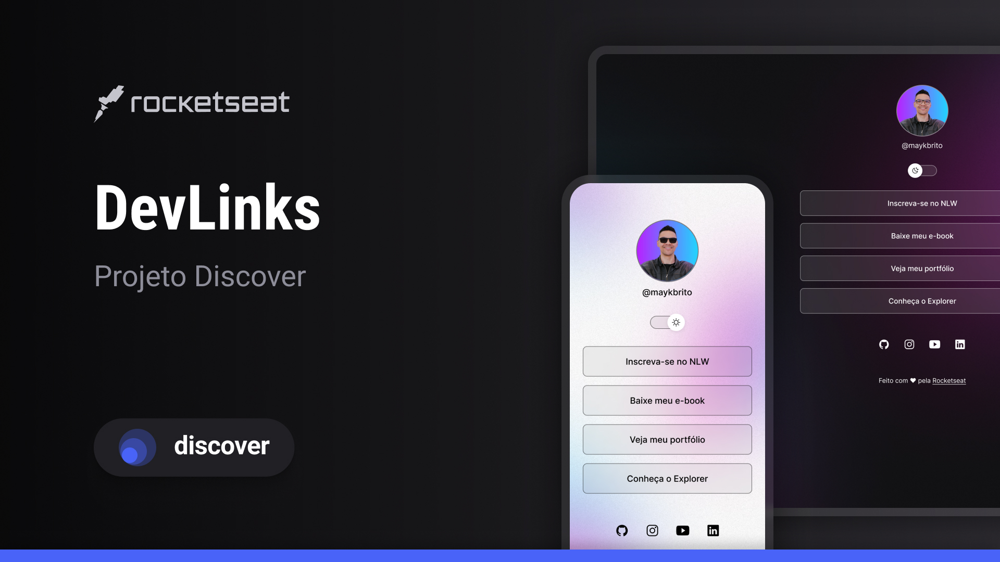

<h1 align="center"> DevLinks </h1>

Programa exclusivo e gratuiro, promovido pela Rocketseat para ensino de tecnologias WEB.

<a href="#tecnologias">Tecnologias</a>&nbsp;&nbsp;&nbsp;|&nbsp;&nbsp;&nbsp;
<a href="#projeto">Projeto</a>&nbsp;&nbsp;&nbsp;|&nbsp;&nbsp;&nbsp;
<a href="#layout">Layout</a>&nbsp;&nbsp;&nbsp;|&nbsp;&nbsp;&nbsp;
<a href="#memo-licença">Licença</a>&nbsp;&nbsp;&nbsp;|&nbsp;&nbsp;&nbsp;

    

    

# Tecnologias
Esse projeto foi desenvolvido com as seguintes tecnlogias:
- HTML e CSS
- JavaScritp
- Git e Github
- Figma

## Projeto
DevLinks é um agregador de links para usar como cartão de visitas online.

## Layout
Você pode visualizar o layout do projeto atravéz <a href="https://www.figma.com/design/albegpBhZvI1bv1Te8QBc3/DevLinks-%E2%80%A2-Projeto-Discover-(Community)?node-id=0-1&t=stxCSDP5hrVmvbLw-0" target="_blank"> DESSE LINK </a>. É necessário ter conta no <a href="https://www.figma.com" target="_blank"> Figma </a> para acessá-lo.

## :memo: Licença
Esse projeto está sob a licença MIT.

---

Feito com ♥ pela <a href="https://www.rocketseat.com.br/" target="_blank"> Rockeseat </a> 

<a href="https://discord.ggg/rocketseat" target="_blank" > Participe da nossa comunidade! </a>

